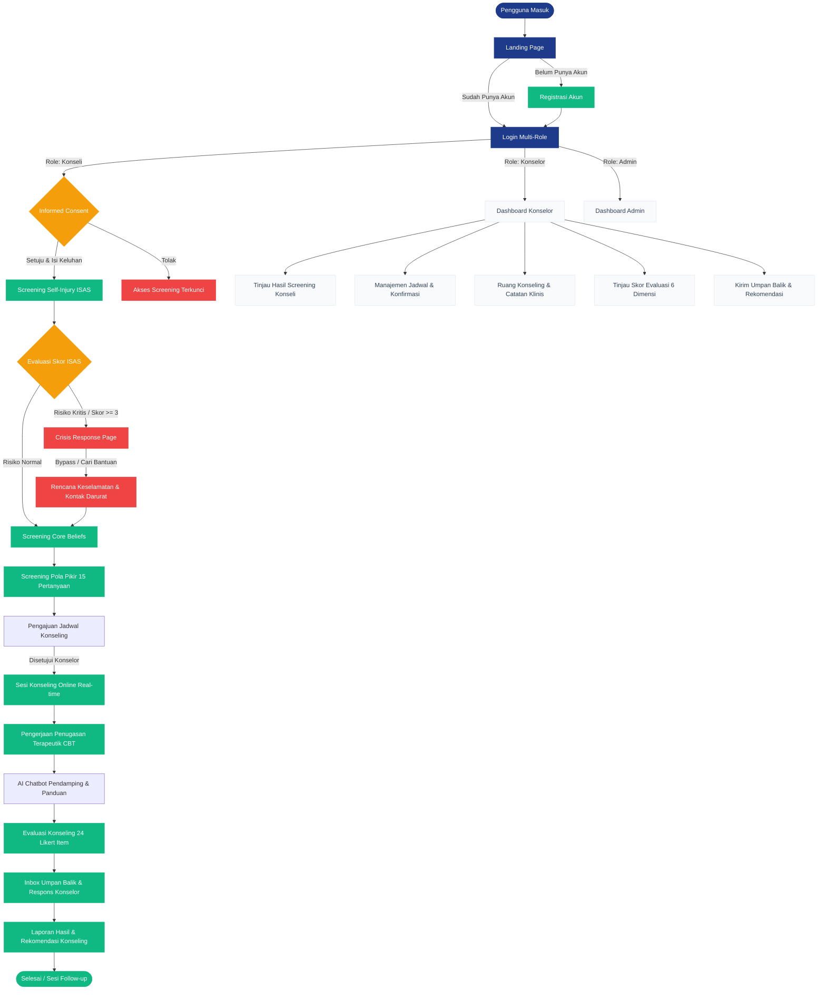

# 🛡️ Mind Shield v2.0 — Platform Tele-Counseling Pencegahan Self-Injury Berbasis CBT

[](https://nextjs.org/)
[](https://www.w3.org/TR/css-modules-1/)
[](https://supabase.com/)
[](https://deepmind.google/technologies/gemini/)
[](https://github.com/lightnet19/mind-shield)

**Mind Shield** adalah platform tele-counseling (konseling online) berbasis web yang dirancang khusus untuk pencegahan tindakan **self-injury** (melukai diri sendiri). Dengan pendekatan **Cognitive Behavioral Therapy (CBT)**, Mind Shield membantu konseli (siswa/klien) memahami hubungan erat antara peristiwa pemicu (*activating events*), pikiran negatif (*beliefs*), reaksi emosi & tubuh (*consequences*), perilaku nyata, hingga pembentukan keyakinan diri yang lebih sehat (*disputation*), sekaligus menyediakan alat pemantauan terstruktur bagi konselor profesional.

---

## 📖 Daftar Isi

1. [Visi & Pendekatan Produk](#-visi--pendekatan-produk)
2. [Alur Layanan Pengguna (User Flow)](#-alur-layanan-pengguna-user-flow)
3. [Fitur Utama & Pembaruan Fase 1](#-fitur-utama--pembaruan-fase-1-sprint-1-updates)
4. [Arsitektur & Tech Stack](#-arsitektur--tech-stack)
5. [Struktur Direktori Proyek](#-struktur-direktori-proyek)
6. [Skema Database (Relasional & Flat-File)](#-skema-database-relasional--flat-file)
7. [Panduan Instalasi & Penggunaan Lokal](#-panduan-instalasi--penggunaan-lokal)
8. [Status Fitur & Roadmap Pengembangan](#-status-fitur--roadmap-pengembangan)
9. [Informasi Operasional & Kontak](#-informasi-operasional--kontak)

---

## 🎯 Visi & Pendekatan Produk

Mind Shield hadir sebagai **ruang digital yang aman, empatik, dan bebas stigma** bagi individu yang menghadapi kecenderungan melukai diri sendiri. Kami mengintegrasikan prinsip CBT secara praktis melalui modul digital interaktif:

*   **Identifikasi Dini:** Mendeteksi tingkat kerawanan self-injury melalui instrumen terstandar (ISAS) dan melacak distorsi kognitif (*core beliefs*).
*   **Safety Net & Crisis Response:** Menyediakan sistem intervensi darurat instan apabila pengguna terdeteksi dalam risiko kritis (*high-risk crisis alert*).
*   **Restrukturisasi Kognitif:** Memandu konseli membedakan antara pikiran otomatis negatif (*negative automatic thoughts*) dengan fakta objektif menggunakan jurnal pemikiran terapeutik.
*   **Kolaborasi Aktif:** Menjembatani interaksi real-time antara konseli dan konselor melalui sesi tatap muka online, pengerjaan tugas therapeutik rumah, dan umpan balik berkala yang terpantau.

---

## 🔄 Alur Layanan Pengguna (User Flow)

Berikut diagram visual yang menggambarkan alur lengkap perjalanan konseli dan konselor di dalam ekosistem web Mind Shield:



---

## ⚡ Fitur Utama & Pembaruan Fase 1 (Sprint 1 Updates)

Fase pertama pengembangan berfokus pada penyelarasan aplikasi dengan revisi spesifikasi instrumen psikologis terbaru, serta perbaikan antarmuka pengguna:

### 📋 1. Modul Informed Consent & Proteksi Akses (Pembaruan)
*   **Deskripsi:** Memblokir seluruh akses menu screening sebelum konseli memberikan tanda centang persetujuan digital pada dokumen *Informed Consent*.
*   **Formulir Keluhan:** Konseli wajib memasukkan rincian deskripsi masalah awal, durasi, serta upaya penanganan mandiri yang pernah dilakukan sebelum memulai layanan.
*   **Visual Locking:** Antarmuka menu screening akan ter-blur dan menampilkan *lock-state* yang elegan apabila persetujuan belum diberikan.

### 🧠 2. Screening Self-Injury ISAS & Sistem Crisis Response
*   **Deskripsi:** Instrumen skrining terstandar menggunakan logika *Inventory of Statements Self-Injury* (ISAS) Bagian I & II.
*   **Logika Deteksi Krisis:** Otomatis mendeteksi skor risiko kritis jika:
    $$\text{Frekuensi Perilaku Melukai Diri} \ge 3 \quad \text{atau} \quad \text{Rata-rata Fungsi} \ge 1.5$$
*   **Crisis Pathway:** Jika kondisi kritis terpenuhi, sistem menghentikan alur biasa dan menavigasi paksa konseli ke halaman **Crisis Response**. Di sini, konseli diberikan modul interaktif penyusunan *Safety Plan* (Rencana Keamanan Mandiri) serta daftar tombol kontak darurat konselor BK dan Admin penanggung jawab sebelum diizinkan mengakses fitur lainnya (*bypass mode*).

### 📝 3. Screening Pola Pikir (Fitur Baru)
*   **Deskripsi:** Instrumen CBT yang menjabarkan keterkaitan antara Peristiwa $\rightarrow$ Pikiran Negatif $\rightarrow$ Emosi $\rightarrow$ Reaksi Fisik $\rightarrow$ Perilaku $\rightarrow$ Keyakinan (Diri Sendiri, Orang Lain, Masa Depan) $\rightarrow$ Restrukturisasi Pikiran Lebih Sehat.
*   **15 Pertanyaan Essay:** Dirancang dengan gaya bahasa ramah, memandu pengguna menuliskan narasi permasalahan pribadi secara interaktif.
*   **Emotion Slider Input:** Pertanyaan ke-4 dilengkapi slider interaktif beranotasi visual (skor 0-100) untuk mengukur intensitas emosi negatif yang dirasakan.
*   **Submisi Terotomatisasi:** Seluruh jawaban langsung diteruskan ke dasbor peninjauan konselor terkait.

### 📊 4. Evaluasi Konseling Online CBT (Fitur Baru)
*   **Deskripsi:** Mengukur tingkat pemulihan pasca-sesi konseling CBT menggunakan **24 item pernyataan Likert 5 skala** (Sangat Sesuai, Sesuai, Ragu-Ragu, Tidak Sesuai, Sangat Tidak Sesuai).
*   **Metode Scoring Kuantitatif:**
    *   *Item Favorable* (1, 3, 5, 7, 8, 9, 11, 12, 13, 14, 16, 17, 18, 19, 21, 22, 24): $\text{SS}=5, \text{S}=4, \text{R}=3, \text{TS}=2, \text{STS}=1$.
    *   *Item Unfavorable* (2, 4, 6, 10, 15, 20, 23): $\text{SS}=1, \text{S}=2, \text{R}=3, \text{TS}=4, \text{STS}=5$.
*   **6 Dimensi Pengukuran:**
    1.  Pengendalian Dorongan Self-Injury (Item 1-4)
    2.  Keyakinan Diri / Self-Worth (Item 5-8)
    3.  Regulasi Emosi (Item 9-12)
    4.  Strategi Coping (Item 13-16)
    5.  Jaringan Keselamatan / Safety Network (Item 17-20)
    6.  Evaluasi Layanan Keseluruhan (Item 21-24)
*   **Visualisasi Dasbor Konselor:** Hasil dikalkulasi instan dan disajikan dalam bentuk diagram radar atau bar chart per dimensi untuk analisis progres cepat.

### 📖 5. Tutorial Penggunaan Interaktif (Fitur Baru)
*   **Deskripsi:** Menyediakan panduan tutorial visual step-by-step berisi **10 langkah penting** pengoperasian sistem bagi pengguna baru.
*   **Navigasi Chatbot:** Terintegrasi langsung dengan menu jalan pintas pada chatbot pendamping untuk aksesibilitas instan kapan saja.

### 💬 6. Portal Umpan Balik Dua Arah & Database Simulasian (Pembaruan)
*   **Deskripsi:** Portal perpesanan interaktif antara Konselor dan Konseli di luar ruang video konseling.
*   **Inbox Konseli:** Dasbor dengan kartu umpan balik yang dapat diekspansi (expand-collapse), penanda status belum dibaca (unread indicators), serta tombol respon cepat.
*   **Formulir Konselor:** Formulir pencarian konseli, filter tingkat risiko, klasifikasi jenis umpan balik, subjek, serta textarea isi pesan.
*   **Prototype Flat-File JSON DB:** Sistem database lokal (`data/db.json` & `lib/db.js`) berbasis Server Actions untuk mendukung simulasi operasional aplikasi, penyimpanan pesan, dan status screening secara penuh secara mandiri tanpa ketergantungan PostgreSQL Supabase pada tahap mockup.

---

## 🛠 Arsitektur & Tech Stack

Platform Mind Shield didesain dengan arsitektur modern berkinerja tinggi:

| Lapisan Teknis | Teknologi Terpilih | Keunggulan & Alasan Penggunaan |
| :--- | :--- | :--- |
| **Pondasi Aplikasi** | Next.js 14 (App Router) | Server-Side Rendering (SSR), API Route bawaan, performa unggul dengan struktur navigasi yang rapi. |
| **Bahasa Utama** | JavaScript (ES6+) | Standar penulisan modern, responsif, dan mudah dikelola dalam lingkungan ekosistem Next.js. |
| **Gaya & Layout** | Vanilla CSS (CSS Modules) | Modular, menghindari bentrok class antar elemen (*no global namespace pollution*), performa loading super cepat tanpa library tambahan. |
| **Komunikasi Real-time** | WebRTC / Jitsi Meet SDK | Latensi super rendah untuk sesi tatap muka interaktif video & audio terenkripsi aman. |
| **Manajemen Database** | Supabase (PostgreSQL Cloud) | Kueri relasional tangguh, Row Level Security (RLS) untuk perlindungan kerahasiaan data klinis, penanganan skema rumit. |
| **Mesin AI Chatbot** | Gemini Pro API | NLP tingkat lanjut untuk pendampingan konseli 24/7, klasifikasi kecenderungan krisis, dan pemetaan emosional otomatis. |

---

## 📂 Struktur Direktori Proyek

Proyek ini terorganisasi dengan struktur konvensi Next.js App Router guna menjamin skalabilitas file:

```
mind-shield-repo/
├── app/
│   ├── admin/                         # Modul Dashboard Administrator
│   │   ├── dashboard/                 # Ringkasan statistik & metrik sistem
│   │   ├── users/                     # Manajemen pengguna & RBAC role
│   │   ├── jadwal/                    # Pengaturan default slot waktu
│   │   ├── monitoring/                # Log audit aktivitas admin
│   │   ├── panduan/                   # Pengelolaan isi dokumen panduan
│   │   └── keamanan/                  # Konfigurasi sistem keamanan & log enkripsi
│   ├── components/                    # Komponen UI global (Chatbot, Modal, dll.)
│   ├── dashboard/                     # Routing umum pasca login
│   ├── konseli/                       # Modul Dashboard Konseli (Siswa)
│   │   ├── evaluasi/                  # [BARU] Halaman 24 Likert evaluasi CBT
│   │   ├── tutorial/                  # [BARU] Halaman panduan 10 langkah interaktif
│   │   ├── umpan-balik/               # [BARU] Halaman kotak masuk umpan balik konseli
│   │   ├── screening/                 # Modul screening self-injury & core beliefs
│   │   │   ├── pola-pikir/            # [BARU] Form 15 pertanyaan pola pikir CBT
│   │   │   └── isas/                  # [BARU] Form ISAS & Logic Krisis
│   │   ├── jadwal/                    # Form pengajuan jadwal konseling
│   │   ├── penugasan/                 # Pengisian modul penugasan terapeutik CBT
│   │   ├── sesi/                      # Ruang video konseling online real-time
│   │   ├── laporan/                   # Unduhan dan cetak berkas hasil konseling
│   │   └── panduan/                   # Panduan umum penggunaan
│   ├── konselor/                      # Modul Dashboard Konselor (Profesional BK)
│   │   ├── kirim-umpan-balik/         # [BARU] Form kirim umpan balik ke konseli
│   │   ├── tinjau-evaluasi/           # [BARU] Dasbor tinjauan 24 item & grafik dimensi
│   │   ├── tinjau-screening/          # Halaman pemeriksaan screening pola pikir & SI
│   │   ├── pasien/                    # Daftar pasien konseli aktif yang diampu
│   │   ├── jadwal/                    # Penerimaan, penolakan, & manajemen jadwal
│   │   ├── sesi/                      # Ruang video konseling & penulisan case formulation
│   │   ├── laporan/                   # Pengisian & validasi rekomendasi akhir
│   │   └── pesan/                     # Komunikasi internal konselor
│   ├── login/                         # Halaman Autentikasi Masuk & login.css
│   ├── register/                      # Halaman Pendaftaran Akun Baru & register.css
│   ├── globals.css                    # Definisi Design Tokens (CSS Variables) global
│   ├── layout.js                      # Root Layout utama Next.js
│   ├── page.js                        # Landing Page utama berdesain premium
│   ├── page.module.css                # Styling Landing Page
│   └── shared.module.css              # Styling Utility & Grid bersama
├── data/
│   └── db.json                        # [BARU] Flat JSON database untuk simulasi prototype
├── lib/
│   └── db.js                          # [BARU] Helper API Server Actions flat-file db
├── public/                            # Direktori penyimpanan logo transparan & aset hero
├── package.json                       # Konfigurasi dependensi project npm
└── next.config.mjs                    # Konfigurasi Next.js bundler
```

---

## 💾 Skema Database (Relasional & Flat-File)

Mind Shield mengusung skema data relasional PostgreSQL yang dirancang dengan pembatasan hak akses Row Level Security (RLS) di Supabase. Pada versi simulasi prototype mandiri saat ini, data dimodelkan ke dalam flat-file `data/db.json`:

### 1. Skema Tabel PostgreSQL Supabase (Production)

```sql
-- Tabel Autentikasi & Akun
CREATE TABLE users (
  id UUID PRIMARY KEY DEFAULT gen_random_uuid(),
  email VARCHAR(255) UNIQUE NOT NULL,
  role VARCHAR(50) CHECK (role IN ('admin', 'konselor', 'konseli')) NOT NULL,
  full_name VARCHAR(255) NOT NULL,
  created_at TIMESTAMPTZ DEFAULT now()
);

-- Profil Spesifik Pengguna
CREATE TABLE profiles (
  user_id UUID PRIMARY KEY REFERENCES users(id) ON DELETE CASCADE,
  contact_number VARCHAR(20),
  emergency_contact VARCHAR(20),
  bio TEXT,
  status VARCHAR(50) DEFAULT 'active'
);

-- Log Persetujuan Informed Consent
CREATE TABLE consent_logs (
  id UUID PRIMARY KEY DEFAULT gen_random_uuid(),
  user_id UUID REFERENCES users(id) ON DELETE CASCADE,
  agreed_at TIMESTAMPTZ DEFAULT now(),
  ip_address VARCHAR(45),
  complaint_description TEXT NOT NULL,
  complaint_duration VARCHAR(100) NOT NULL,
  self_effort TEXT
);

-- Tabel Hasil Screening (Self-Injury, Core Beliefs, Pola Pikir)
CREATE TABLE screening_results (
  id UUID PRIMARY KEY DEFAULT gen_random_uuid(),
  user_id UUID REFERENCES users(id) ON DELETE CASCADE,
  screening_type VARCHAR(50) CHECK (screening_type IN ('self_injury', 'core_beliefs', 'pola_pikir')) NOT NULL,
  answers_json JSONB NOT NULL,
  risk_level VARCHAR(50) DEFAULT 'low', -- low, medium, high, critical
  submitted_at TIMESTAMPTZ DEFAULT now()
);

-- [TABEL BARU] Hasil Evaluasi Konseling CBT (24 Likert Items)
CREATE TABLE evaluation_results (
  id UUID PRIMARY KEY DEFAULT gen_random_uuid(),
  user_id UUID REFERENCES users(id) ON DELETE CASCADE,
  konselor_id UUID REFERENCES users(id),
  answers_json JSONB NOT NULL,          -- {"item_1": 5, "item_2": 2, ...}
  dimension_scores JSONB NOT NULL,      -- {"pengendalian_dorongan": 15, "keyakinan_diri": 18, ...}
  total_score INTEGER NOT NULL,         -- Nilai total: 24 - 120
  submitted_at TIMESTAMPTZ DEFAULT now()
);

-- Tabel Penjadwalan Konseling
CREATE TABLE appointments (
  id UUID PRIMARY KEY DEFAULT gen_random_uuid(),
  konseli_id UUID REFERENCES users(id) ON DELETE CASCADE,
  konselor_id UUID REFERENCES users(id),
  scheduled_at TIMESTAMPTZ NOT NULL,
  status VARCHAR(50) DEFAULT 'pending', -- pending, confirmed, completed, cancelled
  meeting_link TEXT
);

-- Berkas Catatan Konseling & Rekomendasi
CREATE TABLE counseling_notes (
  id UUID PRIMARY KEY DEFAULT gen_random_uuid(),
  appointment_id UUID REFERENCES appointments(id) ON DELETE CASCADE,
  konselor_id UUID REFERENCES users(id),
  formulation TEXT,
  feedback TEXT,
  private_notes TEXT
);

-- Tugas Rumah Terapeutik CBT
CREATE TABLE therapeutic_tasks (
  id UUID PRIMARY KEY DEFAULT gen_random_uuid(),
  appointment_id UUID REFERENCES appointments(id),
  user_id UUID REFERENCES users(id),
  task_description TEXT NOT NULL,
  submission_json JSONB,
  status VARCHAR(50) DEFAULT 'assigned' -- assigned, submitted, reviewed
);

-- Sesi Percakapan Chatbot
CREATE TABLE chatbot_sessions (
  id UUID PRIMARY KEY DEFAULT gen_random_uuid(),
  user_id UUID REFERENCES users(id),
  active_until TIMESTAMPTZ,
  context_data JSONB
);
```

---

## 🚀 Panduan Instalasi & Penggunaan Lokal

Ikuti langkah-langkah berikut untuk menjalankan prototipe Mind Shield di komputer lokal Anda:

### Prasyarat
*   [Node.js](https://nodejs.org/) versi v18.0 atau yang lebih baru.
*   [npm](https://www.npmjs.com/) (atau yarn/pnpm).

### Langkah Instalasi

1.  **Clone Repository:**
    ```bash
    git clone https://github.com/lightnet19/mind-shield.git
    cd mind-shield
    ```

2.  **Install Dependensi:**
    ```bash
    npm install
    ```

3.  **Penggunaan Database Lokal (Mock-up Simulation):**
    Aplikasi saat ini siap dijalankan secara mandiri menggunakan flat database simulasi di `data/db.json` dan helper API Server Actions di `lib/db.js` untuk mensimulasikan penyimpanan dan aksi server tanpa harus mengonfigurasi PostgreSQL cloud.

4.  **Jalankan Server Pengembangan (Dev Server):**
    ```bash
    npm run dev
    ```
    Buka peramban browser Anda di alamat [http://localhost:3000](http://localhost:3000) untuk mulai berinteraksi dengan aplikasi.

---

## 📈 Status Fitur & Roadmap Pengembangan

Progres implementasi berdasarkan spesifikasi modular:

| Modul Fitur | Kategori | Prioritas | Status Implementasi | Rencana Fase |
| :--- | :--- | :--- | :---: | :---: |
| **Landing Page & Auth UI** | Core | High | ✅ Selesai | Fase 1 |
| **Informed Consent Modal Locking** | Core | High | ✅ Selesai | Fase 1 |
| **Screening Self-Injury ISAS** | Core | High | ✅ Selesai | Fase 1 |
| **Screening Core Beliefs** | Core | High | ✅ Selesai | Fase 1 |
| **Screening Pola Pikir (15 Essay)** | Baru | High | ✅ Selesai | Fase 1 (Sprint 1) |
| **Evaluasi Konseling CBT (24 Likert)** | Baru | High | ✅ Selesai | Fase 1 (Sprint 1) |
| **Tutorial Penggunaan (10 Steps)** | Baru | Medium | ✅ Selesai | Fase 1 (Sprint 1) |
| **Tinjau Evaluasi (Dasbor Konselor)** | Baru | High | ✅ Selesai | Fase 1 (Sprint 1) |
| **Umpan Balik Konseli-Konselor** | Baru | High | ✅ Selesai | Fase 1 (Sprint 1) |
| **Prototype Database JSON** | Core | Critical | ✅ Selesai | Fase 1 (Sprint 1) |
| **Integrasi Database & Auth Supabase** | Core | Critical | ⏳ Menunggu | Fase 2 |
| **Ruang Konseling & Real-time WebRTC** | Core | High | ⏳ Menunggu | Fase 3 |
| **Chatbot Pendamping (Gemini API Integration)** | Core | Medium | ⏳ Menunggu | Fase 4 |

---

## 🏫 Informasi Operasional & Kontak

*   **Penyedia Layanan:** Program BK (Bimbingan & Konseling) / Fakultas Ilmu Pendidikan, **Universitas Negeri Malang**
*   **Jam Layanan Konseling Aktif:** Senin - Jumat (08.00 s.d 16.00 WIB)
*   **Penanggung Jawab Sistem (PJ/Admin):** Muh. Syawal Hikmah
*   **Email Kontak Utama:** [mindshield.webapp@um.ac.id](mailto:mindshield.webapp@um.ac.id)
*   **Dokumentasi Terkait:**
    *   [Product Requirements Document (prd.md)](prd.md)
    *   [Development Plan (devplan.md)](devplan.md)
    *   [Developer Change Log (devlog.md)](devlog.md)

---
*Dibuat dengan dedikasi penuh untuk mendukung kesehatan mental remaja dan pelajar Indonesia. Salam Sehat Jiwa.* 🛡️
